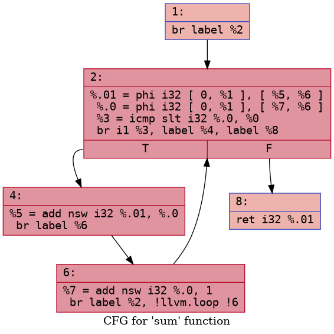
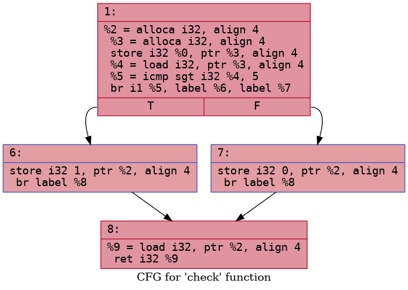

# Control Flow in LLVM IR-`br`, `icmp`, `phi`, and Basic Blocks

Toolchain used: `clang++`/`llvm-dis`/`opt` 18.1.3 (Ubuntu), `dot` (Graphviz).
All `.cpp` sources declare their functions `extern "C"` purely so the IR
keeps readable symbol names (`@check`, `@sum`, `@choose`) instead of
Itanium-mangled ones (`@_Z5checki`) it has no effect on the control
flow being studied.

## Part 1- `if` / `else`: `src/condition.cpp`

```cpp
extern "C" int check(int x) {
    if (x > 5)
        return 1;
    else
        return 0;
}
```

Compiled with `clang++ -O0 -S -emit-llvm src/condition.cpp -o ir/condition.ll`.

### Annotated IR

```llvm
define dso_local i32 @check(i32 noundef %0) #0 {
  %2 = alloca i32, align 4          ; stack slot for the return value
  %3 = alloca i32, align 4          ; stack slot for parameter x
  store i32 %0, ptr %3, align 4     ; x = incoming argument

  %4 = load i32, ptr %3, align 4    ; load x
  %5 = icmp sgt i32 %4, 5           ; %5 = (x > 5), signed greater-than
  br i1 %5, label %6, label %7      ; branch on the i1 result

6:                                  ; "then" block — preds = entry
  store i32 1, ptr %2, align 4      ; return value = 1
  br label %8                       ; jump to the merge block

7:                                  ; "else" block — preds = entry
  store i32 0, ptr %2, align 4      ; return value = 0
  br label %8                       ; jump to the merge block

8:                                  ; merge block — preds = %6, %7
  %9 = load i32, ptr %2, align 4    ; reload the return value
  ret i32 %9
}
```

### Answers

**How is `x > 5` checked?**
With a single `icmp sgt i32 %4, 5` instruction. `icmp` is LLVM's generic
comparison instruction `sgt` is the predicate ("signed greater-than").
It produces an `i1` (one-bit boolean) result here `%5` that is `true`
only when `x`'s value is strictly greater than 5.

**How is the `if`/`else` structure implemented?**
As a conditional branch, `br i1 %5, label %6, label %7`, that sends
control to one of two basic blocks: block `%6` holds the compiled `then`
body, block `%7` holds the compiled `else` body. Both blocks end by
unconditionally jumping (`br label %8`) to a shared merge block, so
control always reunites after the `if`/`else` regardless of which branch
ran.

**How does LLVM determine which return value to use?**
At `-O0`, LLVM doesn't use a `phi` here it uses the memory pattern
instead a stack slot (`%2`, the "return value" alloca) is written by
whichever branch executes (`store i32 1, ptr %2` or `store i32 0, ptr
%2`), and the merge block simply reloads that slot (`load i32, ptr %2`)
before returning it. This store/load-through-memory style is exactly
what unoptimized (`-O0`) Clang always emits the whole point of
`-O0` is "one alloca per local, no register promotion," so it defers
the optimizer's job of proving the memory accesses are redundant and
promoting them to SSA registers with `phi` nodes. See the note on
`phi` below for what happens once that promotion runs.


## Part 2- Loop: `src/loop.cpp`

```cpp
extern "C" int sum(int n) {
    int s = 0;
    for (int i = 0; i < n; ++i)
        s += i;
    return s;
}
```

### A note on `-O0` and `phi`

Compiling this straight at `-O0` (`clang++ -O0 -S -emit-llvm src/loop.cpp
-o ir/loop.ll`). `-O0` keeps every local variable (`n`, `s`, `i`)
in its own stack slot and threads all reads/writes through
`load`/`store`, the same "memory SSA" style seen in `check()` above.
The loop variable `i` is just a memory cell that gets loaded, compared,
incremented, and stored back on every iteration- a `phi` node never
appears because nothing has been promoted to a register yet.

To actually observe the `phi` node the exercise asks about, mem2reg
(LLVM's stack→register promotion pass) has to run. `-O0` output is
marked `optnone`, which blocks `opt` from running any pass on it
(including `mem2reg` alone), so it was regenerated with the `optnone`
attribute suppressed and then promoted:

```bash
clang++ -O0 -Xclang -disable-O0-optnone -S -emit-llvm src/loop.cpp -o ir/loop_noopt.ll
opt -passes=mem2reg -S ir/loop_noopt.ll -o ir/loop_mem2reg.ll
```

(Using `-O1` instead of this two-step process was tried first, but
`-O1` also runs LLVM's scalar-evolution / loop-strength-reduction
passes, which recognize `sum` as a closed-form arithmetic series and
delete the loop entirely no basic blocks worth studying survive.
`mem2reg` alone promotes locals to registers without touching the loop
structure, which is the right amount of optimization for this
exercise.)

### Annotated IR (`ir/loop_mem2reg.ll`, SSA form with `phi`)

```llvm
define dso_local i32 @sum(i32 noundef %0) #0 {
  br label %2                                  

2:                                             
  %.01 = phi i32 [ 0, %1 ], [ %5, %6 ]          
  %.0  = phi i32 [ 0, %1 ], [ %7, %6 ]         
  %3 = icmp slt i32 %.0, %0                    
  br i1 %3, label %4, label %8                  

4:                                             
  %5 = add nsw i32 %.01, %.0                    
  br label %6                                  

6:                                             
  %7 = add nsw i32 %.0, 1                       
  br label %2, !llvm.loop !6                  
8:                                            
  ret i32 %.01                                  
}
```

### Answers

**What role does the `phi` node play?**
A `phi` ("phi function") picks a value for an SSA register based on
which predecessor block control arrived from it's how LLVM
represents "this variable has different definitions depending on the
path taken" without mutable memory. Here `%.01` (representing `s`) and
`%.0` (representing `i`) are each defined by a `phi`on the first entry
into block `%2` they come from block `%1` (the function entry, value
`0`), and on every subsequent iteration they come from block `%6` (the
loop latch, the freshly updated values `%5` and `%7`).

**How does LLVM remember the loop variable `i` across iterations?**
Through the `phi` node `%.0` itself. There's no mutable variable in SSA
form; instead, each iteration produces a *new* SSA value (`%7 = add
nsw i32 %.0, 1`), and the `phi` at the top of the loop header is what
"merges" the previous iteration's incremented value back into the name
used by the next iteration's comparison and body. Conceptually, the
`phi` is the loop variable.

**How is the loop exit condition implemented?**
By `icmp slt i32 %.0, %0` (`i < n`, signed less-than) feeding a
conditional branch `br i1 %3, label %4, label %8`. As long as the
comparison is true, control goes to `%4` (the body → latch → back to
the header), the moment it's false, control goes to `%8`, the exit
block, which returns the final value of `s`.

### Control-Flow Graph

`opt -passes=dot-cfg ir/loop_mem2reg.ll` was used to emit the CFG
(`opt`'s modern pass-manager syntax the classic `opt -dot-cfg
ir/loop.ll` from older LLVM versions is equivalent), then rendered with
Graphviz:

```bash
opt -passes=dot-cfg ir/loop_mem2reg.ll -disable-output   
dot -Tpng cfg.sum.dot -o loop_cfg.png
```



Block labels, by role:
- **`%1` (entry)**- falls straight through to the header, this is where
  `n`'s incoming value lives before the loop starts.
- **`%2` (loop header / condition)** -holds both `phi` nodes and the
  `icmp`/`br` that decide "keep looping or exit."
- **`%4` (loop body)** -computes `s + i` for this iteration.
- **`%6` (loop latch)**- computes `i + 1` and jumps back to the header,
  this is the block that closes the loop (its `br` targets `%2`, the
  same block that dominates it).
- **`%8` (exit)**- reached only when the header's comparison fails,
  returns the final accumulated `s`.




### Annotated IR

```llvm
define dso_local i32 @choose(i32 noundef %0) #0 {
  %2 = alloca i32, align 4
  %3 = alloca i32, align 4
  store i32 %0, ptr %3, align 4
  %4 = load i32, ptr %3, align 4
  switch i32 %4, label %7 [               
    i32 1, label %5
    i32 2, label %6
  ]

5:                                         
  store i32 100, ptr %2, align 4
  br label %8

6:                                        
  store i32 200, ptr %2, align 4
  br label %8

7:                                         
  store i32 -1, ptr %2, align 4
  br label %8

8:                                         
  %9 = load i32, ptr %2, align 4
  ret i32 %9
}
```

LLVM has a dedicated `switch` instruction rather than lowering directly
to a chain of `icmp`/`br` pairs `switch i32 %4, label %7 [ i32 1,
label %5  i32 2, label %6 ]` names the value being switched on (`%4`),
the default destination (`label %7`, used when no case matches), and
an explicit `[value, label]` table for each case. This single
instruction is deliberately kept high-level in the IR so that later
optimization passes (not the frontend) get to decide how to lower
it for a small, dense set of case values like `{1, 2}` here, codegen
will typically produce a compare-and-branch chain or a small jump
table depending on the target and the case density/spread with only
two cases clang/LLVM's backend chose a simple compare chain, but for
larger, denser case sets LLVM commonly lowers `switch` to an actual 
jump table (an indexed array of blockaddresses) for O(1) dispatch 
instead of a chain of comparisons.


